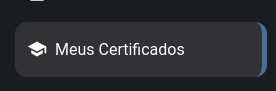
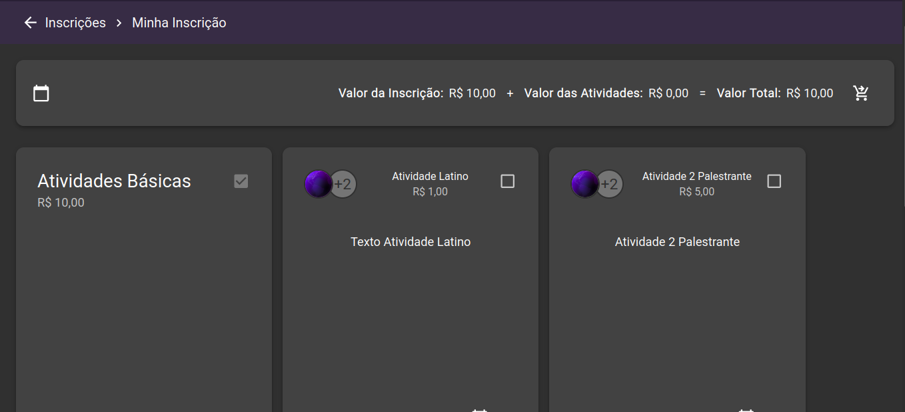

<table style="width: 100%">
<thead style="width: 100%">
  <tr style="width: 100%">
    <th rowspan="2" style="width: 100%"></th>
    <th style="width: 100%">Projeto</th>
    <th style="width: 100%">Data</th>
    <th style="width: 100%">Revisão</th>
  </tr>
  <tr>
    <th>LATINOWARE</th>
    <th>31/12/2022</th>
    <th>01</th>
  </tr>
</thead>
<tbody>
  <tr>
    <td colspan="4" style="text-align: center">DOCUMENTAÇÃO FINAL - LATINOWARE</td>
  </tr>
</tbody>
</table>

**FUNDAÇÃO PARQUE TECNOLÓGICO DE ITAIPU**

> **DOCUMENTAÇÃO DE USABILIDADE DO SISTEMA WEB DE GESTÃO DE EVENTOS SWGE VERSÃO LATINOWARE**

**Versão 1.1**

<table style="width: 100%">
<thead style="width: 100%">
  <tr style="width: 100%">
    <th rowspan="2" style="width: 100%"></th>
    <th style="width: 100%">Projeto</th>
    <th style="width: 100%">Data</th>
    <th style="width: 100%">Revisão</th>
  </tr>
  <tr>
    <th>LATINOWARE</th>
    <th>31/12/2022</th>
    <th>01</th>
  </tr>
</thead>
<tbody>
  <tr>
    <td colspan="4" style="text-align: center">DOCUMENTAÇÃO FINAL - LATINOWARE</td>
  </tr>
</tbody>
</table>

***EQUIPE RESPONSÁVEL***

***Desenvolvimento***

- [Full Stack - Guilherme Rodrigues Sganderla](./../../README.md#colaboradores)
- [Frontend - Nata Rafael Cruz de Jesus](./../../README.md#colaboradores)
- [Frontend - Alana Castro dos Santos](./../../README.md#colaboradores)
- [Q&A - Gilson Dias de Oliveira](./../../README.md#colaboradores)
- [Designer - André Domingos Vasconcelos](./../../README.md#colaboradores)
- [DevOps - Carlos Henrique Leite](./../../README.md#colaboradores)

***Gestão***

- [Lider Técnico - Valéria Nunes dos Santos](./../../README.md#colaboradores)
- [PMO - Mateus Schindler](./../../README.md#colaboradores)
- [PMO Convênio - Luiz Felipe Cavalcanti De Albuquerque](./../../README.md#colaboradores)

***Documentação***

- Documentos de Usabilidade
  - [Samuel Dos Santos (voluntário)](./../../README.md#colaboradores)
  - [Mateus Schindler](./../../README.md#colaboradores)
- Termos de Uso (Sistema e API) e Política de Privacidade
  - [Felipe Theodoro Guimaraes](./../../README.md#colaboradores)
- DPO
  - [Gilson Herminio Rocha Junior](./../../README.md#colaboradores)

***Demandante***

- [Marcos Antônio Dellazari](./../../README.md#colaboradores)
- [Marcos Siríaco](./../../README.md#colaboradores)
- [Luciano Lourenço Da Silva](./../../README.md#colaboradores)

<table style="width: 100%">
<thead style="width: 100%">
  <tr style="width: 100%">
    <th rowspan="2" style="width: 100%"></th>
    <th style="width: 100%">Projeto</th>
    <th style="width: 100%">Data</th>
    <th style="width: 100%">Revisão</th>
  </tr>
  <tr>
    <th>LATINOWARE</th>
    <th>31/12/2022</th>
    <th>01</th>
  </tr>
</thead>
<tbody>
  <tr>
    <td colspan="4" style="text-align: center">DOCUMENTAÇÃO FINAL - LATINOWARE</td>
  </tr>
</tbody>
</table>

**1.** **INTRODUÇÃO**                  

Neste documento o usuário verá todas as informações que compõem as telas
do Software de Gestão de Eventos da Latinoware.

**2.** **DESCRIÇÃO DAS FUNCIONALIDADES**

**2.1** **Início**\
Ao selecionarmos o menu auxiliar teremos acesso a opção início, clicando
sobre ele seremos levados a tela inicial do sistema, ali vamos encontrar
algumas dicas de customização para o administrador customizar a tela de
início. Abaixo é se acaso for encontrado algum problema no sistema ou se
o usuário quiser fornecer a sua sugestão sobre o sistema ele poderá ir
em feedback e após em meus feedbacks.

Selecionando a setinha que fica no canto superior direito o usuário
poderá acessar os dados de sua conta ou poderá sair de sua conta.

<table style="width: 100%">
<thead style="width: 100%">
  <tr style="width: 100%">
    <th rowspan="2" style="width: 100%"></th>
    <th style="width: 100%">Projeto</th>
    <th style="width: 100%">Data</th>
    <th style="width: 100%">Revisão</th>
  </tr>
  <tr>
    <th>LATINOWARE</th>
    <th>31/12/2022</th>
    <th>01</th>
  </tr>
</thead>
<tbody>
  <tr>
    <td colspan="4" style="text-align: center">DOCUMENTAÇÃO FINAL - LATINOWARE</td>
  </tr>
</tbody>
</table>

Clicando na bandeira que fica ao lado da setinha podemos alterar o
idioma do sistema.

Ao clicarmos no sol que fica ao lado do alterar idioma poderemos alterar
o tema atual do sistema, por padrão ele vem no modo branco e se
quisermos alterá-lo basta apenas clicarmos na lua que assim ele irá
mudar para o modo escuro.

<table style="width: 100%">
<thead style="width: 100%">
  <tr style="width: 100%">
    <th rowspan="2" style="width: 100%"></th>
    <th style="width: 100%">Projeto</th>
    <th style="width: 100%">Data</th>
    <th style="width: 100%">Revisão</th>
  </tr>
  <tr>
    <th>LATINOWARE</th>
    <th>31/12/2022</th>
    <th>01</th>
  </tr>
</thead>
<tbody>
  <tr>
    <td colspan="4" style="text-align: center">DOCUMENTAÇÃO FINAL - LATINOWARE</td>
  </tr>
</tbody>
</table>

Clicando no número 2222 poderemos ver uma lista de todas as edições do
momento, nela podemos selecionar a edição que queremos.

<table style="width: 100%">
<thead style="width: 100%">
  <tr style="width: 100%">
    <th rowspan="2" style="width: 100%"></th>
    <th style="width: 100%">Projeto</th>
    <th style="width: 100%">Data</th>
    <th style="width: 100%">Revisão</th>
  </tr>
  <tr>
    <th>LATINOWARE</th>
    <th>31/12/2022</th>
    <th>01</th>
  </tr>
</thead>
<tbody>
  <tr>
    <td colspan="4" style="text-align: center">DOCUMENTAÇÃO FINAL - LATINOWARE</td>
  </tr>
</tbody>
</table>

Selecionando o ponto de interrogação teremos acesso a opção de ajuda, ao
clicarmos sobre ela uma mão azul surgirá apontando para a setinha e ao
apertarmos para onde ela está apontando nos será mostrado uma tela de
demonstração, que ajudará o usuário a entender para que cada uma
daquelas quatro opções serve.

E por fim, ao selecionarmos as três barrinhas que ficam ao lado da
escrita Latinoware 2022, teremos acesso ao menu auxiliar. É através dele
que poderemos ter acesso a todas as opções e funcionalidades do sistema.

**2.2** **Minha Conta**\
Selecionando o menu auxiliar teremos acesso a opção minha conta, nela o
usuário preencherá todas as suas informações pessoais.

<table style="width: 100%">
<thead style="width: 100%">
  <tr style="width: 100%">
    <th rowspan="2" style="width: 100%"></th>
    <th style="width: 100%">Projeto</th>
    <th style="width: 100%">Data</th>
    <th style="width: 100%">Revisão</th>
  </tr>
  <tr>
    <th>LATINOWARE</th>
    <th>31/12/2022</th>
    <th>01</th>
  </tr>
</thead>
<tbody>
  <tr>
    <td colspan="4" style="text-align: center">DOCUMENTAÇÃO FINAL - LATINOWARE</td>
  </tr>
</tbody>
</table>

Como mostrado na imagem abaixo ele deverá informar seu nome, seu e-mail,
abaixo ele terá o seu id que já vem preenchido, deverá também informar
sua data de nascimento, seu país, estado e cidade de origem, o endereço
da fundação PTI, seu número de celular e telefone, qual o seu sexo, se
possuí ou não algum tipo de deficiência, também poderá escrever sua
biografia, se desejar poderá colocar os links de suas redes sociais como
o GitHub, poderá colocar seu id orcid, o link de seu website se tiver
algum e o link de seu currículo lattes caso tenha um.

Descendo um pouco mais a tela teremos acesso a opção de editar perfil.

<table style="width: 100%">
<thead style="width: 100%">
  <tr style="width: 100%">
    <th rowspan="2" style="width: 100%"></th>
    <th style="width: 100%">Projeto</th>
    <th style="width: 100%">Data</th>
    <th style="width: 100%">Revisão</th>
  </tr>
  <tr>
    <th>LATINOWARE</th>
    <th>31/12/2022</th>
    <th>01</th>
  </tr>
</thead>
<tbody>
  <tr>
    <td colspan="4" style="text-align: center">DOCUMENTAÇÃO FINAL - LATINOWARE</td>
  </tr>
</tbody>
</table>

Clicando nela o usuário será direcionado à esta tela, aqui ele poderá
fazer a alteração de suas informações bem como adicionar mais algum
outro campo que ele queira.

O usuário poderá também receber as informações da Latinoware em seu
e-mail marcando o campo abaixo, e também poderá permitir que a
plataforma use seus dados para contato caso a mesma precise entrar em
contato com o usuário, ao final se adicionado todas as informações o
usuário poderá salvá-las, poderá cancelar a ação ou solicitar ao sistema
a exclusão de sua conta.

**2.3** **Meus Certificados**\
Ao selecionarmos o menu auxiliar teremos acesso a opção meus
certificados, aqui os usuários poderão ver todos os certificados que
eles têm disponível.

<table style="width: 100%">
<thead style="width: 100%">
  <tr style="width: 100%">
    <th rowspan="2" style="width: 100%"></th>
    <th style="width: 100%">Projeto</th>
    <th style="width: 100%">Data</th>
    <th style="width: 100%">Revisão</th>
  </tr>
  <tr>
    <th>LATINOWARE</th>
    <th>31/12/2022</th>
    <th>01</th>
  </tr>
</thead>
<tbody>
  <tr>
    <td colspan="4" style="text-align: center">DOCUMENTAÇÃO FINAL - LATINOWARE</td>
  </tr>
</tbody>
</table>

Nesta tela o usuário poderá ver o nome das atividades, a trilha a qual
ela pertence, o tipo do certificado, a data que ele estará disponível,
poderá também fazer a pré-visualização do certificado e ao final poderão
visualizá-lo.

Selecionando a lupa que fica no canto superior direito o usuário poderá
pesquisar pelo nome da atividade.

E ao selecionar as três barrinhas brancas que ficam ao lado da lupa os
usuários poderão ver todas as colunas, caso ele queira procurar por uma
informação em específico ele poderá marcar a opção a qual ela pertence e
desmarcar as demais.

<table style="width: 100%">
<thead style="width: 100%">
  <tr style="width: 100%">
    <th rowspan="2" style="width: 100%"></th>
    <th style="width: 100%">Projeto</th>
    <th style="width: 100%">Data</th>
    <th style="width: 100%">Revisão</th>
  </tr>
  <tr>
    <th>LATINOWARE</th>
    <th>31/12/2022</th>
    <th>01</th>
  </tr>
</thead>
<tbody>
  <tr>
    <td colspan="4" style="text-align: center">DOCUMENTAÇÃO FINAL - LATINOWARE</td>
  </tr>
</tbody>
</table>

**2.4 Secretária**\
Ao selecionarmos o menu auxiliar teremos acesso a opção secretária,
selecionando a setinha que fica no canto superior direito teremos acesso
ao submenu com outras três opções dentro dela, etiquetas, cadastrar
usuário e a gerenciar inscrições.

**2.4.1 Etiquetas**\
Nesta tela nos é apresentado o nome do usuário bem como o nome que ele
escolheu para pôr em seu crachá.

<table style="width: 100%">
<thead style="width: 100%">
  <tr style="width: 100%">
    <th rowspan="2" style="width: 100%"></th>
    <th style="width: 100%">Projeto</th>
    <th style="width: 100%">Data</th>
    <th style="width: 100%">Revisão</th>
  </tr>
  <tr>
    <th>LATINOWARE</th>
    <th>31/12/2022</th>
    <th>01</th>
  </tr>
</thead>
<tbody>
  <tr>
    <td colspan="4" style="text-align: center">DOCUMENTAÇÃO FINAL - LATINOWARE</td>
  </tr>
</tbody>
</table>

Se o usuário selecionar a lupa poderá fazer uma pesquisa pelo nome ou
pelo nome para crachá do usuário, já se selecionar as três barrinhas ao
lado da lupa podemos ver as duas colunas, se o usuário decidir procurar
por um nome ou nome para crachá em específico ele poderá marcar ou
desmarcar uma das colunas. Selecionando a última opção o usuário poderá
filtrar pelo nome de um usuário em específico.

**2.4.2 Usuários Tutelados:**\
Já nesta tela temos as mesmas opções do item acima, muda apenas que
nesta terá apenas usuários tutelados.

<table style="width: 100%">
<thead style="width: 100%">
  <tr style="width: 100%">
    <th rowspan="2" style="width: 100%"></th>
    <th style="width: 100%">Projeto</th>
    <th style="width: 100%">Data</th>
    <th style="width: 100%">Revisão</th>
  </tr>
  <tr>
    <th>LATINOWARE</th>
    <th>31/12/2022</th>
    <th>01</th>
  </tr>
</thead>
<tbody>
  <tr>
    <td colspan="4" style="text-align: center">DOCUMENTAÇÃO FINAL - LATINOWARE</td>
  </tr>
</tbody>
</table>

Se o usuário selecionar a lupa poderá fazer uma pesquisa pelo nome ou
pelo nome para crachá do usuário, já se selecionar as três barrinhas ao
lado da lupa podemos ver as duas colunas, se o usuário decidir procurar
por um nome ou nome para crachá em específico ele poderá marcar ou
desmarcar uma das colunas. Selecionando a última opção o usuário poderá
filtrar pelo nome de um usuário em específico.

**2.4.3 Caravanas**\
Aqui podemos ver o nome das caravanas e também o número de usuários
cadastrados em cada uma delas.

<table style="width: 100%">
<thead style="width: 100%">
  <tr style="width: 100%">
    <th rowspan="2" style="width: 100%"></th>
    <th style="width: 100%">Projeto</th>
    <th style="width: 100%">Data</th>
    <th style="width: 100%">Revisão</th>
  </tr>
  <tr>
    <th>LATINOWARE</th>
    <th>31/12/2022</th>
    <th>01</th>
  </tr>
</thead>
<tbody>
  <tr>
    <td colspan="4" style="text-align: center">DOCUMENTAÇÃO FINAL - LATINOWARE</td>
  </tr>
</tbody>
</table>

Se o usuário selecionar a lupa poderá fazer uma pesquisa pelo nome da
caravana, já se selecionar as três barrinhas ao lado da lupa podemos ver
as duas colunas, se o usuário decidir procurar por uma informação em
específico ele poderá marcar uma coluna e desmarcar as demais.
Selecionando a última opção o usuário poderá filtrar pelo nome de uma
das caravanas em específico.

**2.4.4 Cadastrar Usuário**\
Nesta tela poderemos cadastrar um novo usuário, aqui precisaremos
inserir todos os dados do usuário como o seu nome, um nome para seu
crachá, o seu e-mail, escolher o seu sexo, inserir sua data de
nascimento, o país em que nasceu, o seu cep, o estado e cidade de
nascimento, o seu endereço, se possui alguma deficiência a instituição a
qual faz parte, o seu número de celular e o de telefone e ao rolarmos
mais um pouco para baixo teremos uma última opção a isentar, se for
desejado isentar o usuário poderá marcar a caixa, caso não esta opção
ficará desmarcada.

<table style="width: 100%">
<thead style="width: 100%">
  <tr style="width: 100%">
    <th rowspan="2" style="width: 100%"></th>
    <th style="width: 100%">Projeto</th>
    <th style="width: 100%">Data</th>
    <th style="width: 100%">Revisão</th>
  </tr>
  <tr>
    <th>LATINOWARE</th>
    <th>31/12/2022</th>
    <th>01</th>
  </tr>
</thead>
<tbody>
  <tr>
    <td colspan="4" style="text-align: center">DOCUMENTAÇÃO FINAL - LATINOWARE</td>
  </tr>
</tbody>
</table>

**2.4.5 Gerenciar Inscrições**\
Nesta primeira tela temos o usuário, data e hora da inscrição, preço e a
situação do pagamento.

- **Usuário:** O nome cadastrado pelo usuário.

- **Data e hora da inscrição:** Data e hora em que a inscrição foi
realizada.

- **Preço:** Valor que o usuário deverá pagar na hora de sua inscrição.

- **Situação do pagamento**: Se o usuário realizou o pagamento de sua
inscrição.\

Se o usuário selecionar a lupa poderá fazer uma pesquisa pelo
nome do usuário, já se selecionar as três barrinhas ao lado da lupa
podemos ver as duas colunas, se o usuário decidir procurar por uma
informação em específico ele poderá marcar uma coluna e desmarcar as
demais. Selecionando a última opção o usuário poderá filtrar pelo nome
de usuário e pela situação do pagamento.

<table style="width: 100%">
<thead style="width: 100%">
  <tr style="width: 100%">
    <th rowspan="2" style="width: 100%"></th>
    <th style="width: 100%">Projeto</th>
    <th style="width: 100%">Data</th>
    <th style="width: 100%">Revisão</th>
  </tr>
  <tr>
    <th>LATINOWARE</th>
    <th>31/12/2022</th>
    <th>01</th>
  </tr>
</thead>
<tbody>
  <tr>
    <td colspan="4" style="text-align: center">DOCUMENTAÇÃO FINAL - LATINOWARE</td>
  </tr>
</tbody>
</table>

Clicando no lápis que fica após a situação do pagamento poderemos ver as
informações da inscrição e logo abaixo será apresentado as atividades em
que o usuário se inscreveu.

**2.4.5.1 Inscrições de Usuários Tutelados**\
Na inscrição de usuários tutelados temos os mesmos campos que no item
acima, muda apenas que o usuário deverá entregar ao seu responsável um
termo de autorização para que assim ele possa prosseguir com sua
inscrição.

<table style="width: 100%">
<thead style="width: 100%">
  <tr style="width: 100%">
    <th rowspan="2" style="width: 100%"></th>
    <th style="width: 100%">Projeto</th>
    <th style="width: 100%">Data</th>
    <th style="width: 100%">Revisão</th>
  </tr>
  <tr>
    <th>LATINOWARE</th>
    <th>31/12/2022</th>
    <th>01</th>
  </tr>
</thead>
<tbody>
  <tr>
    <td colspan="4" style="text-align: center">DOCUMENTAÇÃO FINAL - LATINOWARE</td>
  </tr>
</tbody>
</table>

**2.5** **Cadastros**\
Ao acessarmos o menu auxiliar teremos acesso a opção cadastro, e
selecionando a setinha que fica no canto superior direito teremos acesso
a um submenu com oito opções dentro dela, a usuários, caravanas,
instituições, edições, atividades, trilhas, certificados e por fim
vouchers.

<table style="width: 100%">
<thead style="width: 100%">
  <tr style="width: 100%">
    <th rowspan="2" style="width: 100%"></th>
    <th style="width: 100%">Projeto</th>
    <th style="width: 100%">Data</th>
    <th style="width: 100%">Revisão</th>
  </tr>
  <tr>
    <th>LATINOWARE</th>
    <th>31/12/2022</th>
    <th>01</th>
  </tr>
</thead>
<tbody>
  <tr>
    <td colspan="4" style="text-align: center">DOCUMENTAÇÃO FINAL - LATINOWARE</td>
  </tr>
</tbody>
</table>

**2.5.1 Usuários**\
Nesta tela poderemos ver o nome do usuário, o nome que ele colocou em
seu usuário, o e se ele está ou não habilitado.

<table style="width: 100%">
<thead style="width: 100%">
  <tr style="width: 100%">
    <th rowspan="2" style="width: 100%"></th>
    <th style="width: 100%">Projeto</th>
    <th style="width: 100%">Data</th>
    <th style="width: 100%">Revisão</th>
  </tr>
  <tr>
    <th>LATINOWARE</th>
    <th>31/12/2022</th>
    <th>01</th>
  </tr>
</thead>
<tbody>
  <tr>
    <td colspan="4" style="text-align: center">DOCUMENTAÇÃO FINAL - LATINOWARE</td>
  </tr>
</tbody>
</table>

Ao clicarmos no lápis que fica logo após o habilitado, poderemos
atualizar as informações já cadastradas.

Selecionando a lupa que fica no canto superior direito podemos fazer uma
busca por um usuário em específico utilizando as informações que foram
cadastradas por ele.

<table style="width: 100%">
<thead style="width: 100%">
  <tr style="width: 100%">
    <th rowspan="2" style="width: 100%"></th>
    <th style="width: 100%">Projeto</th>
    <th style="width: 100%">Data</th>
    <th style="width: 100%">Revisão</th>
  </tr>
  <tr>
    <th>LATINOWARE</th>
    <th>31/12/2022</th>
    <th>01</th>
  </tr>
</thead>
<tbody>
  <tr>
    <td colspan="4" style="text-align: center">DOCUMENTAÇÃO FINAL - LATINOWARE</td>
  </tr>
</tbody>
</table>

Já utilizando a opção que está ao lado da lupa poderemos ver as colunas,
caso o usuário busque por uma informação em específico poderá deixar
marcando a coluna a qual ela pertence e desmarcar as demais.

Esta terceira opção é a filtro, aqui o usuário verá que existem seções
divididas entre nome, nome para usuário, o e habilitado. Dentro de cada
uma dessas seções poderemos ver as informações de cada um dos usuários
que estão cadastrados no sistema, caso seja preciso procurar por uma
determinada informação de um usuário em específico ele poderá marcar um
dos campos de algumas das seções abaixo e após ir em aplicar filtro, e
se selecionado algum campo que não queira ele poderá desmarcar clicando
na opção limpar que fica logo após a escrita filtros e marcar o campo
correto.

<table style="width: 100%">
<thead style="width: 100%">
  <tr style="width: 100%">
    <th rowspan="2" style="width: 100%"></th>
    <th style="width: 100%">Projeto</th>
    <th style="width: 100%">Data</th>
    <th style="width: 100%">Revisão</th>
  </tr>
  <tr>
    <th>LATINOWARE</th>
    <th>31/12/2022</th>
    <th>01</th>
  </tr>
</thead>
<tbody>
  <tr>
    <td colspan="4" style="text-align: center">DOCUMENTAÇÃO FINAL - LATINOWARE</td>
  </tr>
</tbody>
</table>

Ao clicarmos na opção de adicionar usuários ou no (mais), seremos
redirecionados a tela da imagem abaixo, nela o usuário preencherá todas
as suas informações pessoais e ao final poderão ser dadas algumas
permissões a ele dentro do sistema. Logo abaixo do campo de permissões
teremos outros quatro campos: administrador, habilitado, e-mail
confirmado e o enviar informações da Latinoware por e-mail.

- **Administrador:** Caso o usuário for habilitado como um administrador
do sistema este campo deverá ser marcado.

- **Habilitado:** Se o usuário for habilitado este campo deve ser
marcado.

- **E-mail confirmado:** Se o usuário já confirmou seu e-mail.                         
                                
- **Enviar informações da Latinoware por e-mail:** Marcando essa caixa o usuário receberá as informações do evento em seu e-mail.

<table style="width: 100%">
<thead style="width: 100%">
  <tr style="width: 100%">
    <th rowspan="2" style="width: 100%"></th>
    <th style="width: 100%">Projeto</th>
    <th style="width: 100%">Data</th>
    <th style="width: 100%">Revisão</th>
  </tr>
  <tr>
    <th>LATINOWARE</th>
    <th>31/12/2022</th>
    <th>01</th>
  </tr>
</thead>
<tbody>
  <tr>
    <td colspan="4" style="text-align: center">DOCUMENTAÇÃO FINAL - LATINOWARE</td>
  </tr>
</tbody>
</table>

**2.5.2 Caravanas**

Nesta tela podemos ver o nome da caravana, o país, estado, cidade,
instituição, coordenador,

tipo, preço, vagas e situação do pagamento.

**1.** **Nome:** O nome dado a caravana.

**2.** **País:** País a qual a instituição responsável pela caravana
pertence.

**3.** **Estado:** Estado a qual a instituição responsável pela caravana
pertence.

**4.** **Cidade:** Cidade a qual a instituição responsável pela caravana pertence.              
                                
**5.** **Instituição:** Instituição responsável pela caravana.      
                                
**6.** **Coordenador:** Nome do responsável por coordenar a     caravana.                       
                                
**7.** **Tipo:** Existem dois tipos de caravanas, a comum e a tutelada a diferença entre elas estão sendo apresentada abaixo:

**8.** **Comum:** É realizada manualmente pelo usuário, sendo o
coordenador responsável

apenas por confirmá-la.

**9.** **Tutelada:** É realizada pelo próprio coordenador, já que
usuário não terá acesso ao

sistema. Os usuários desta modalidade poderão ou não serem menores de
idade.

**10.** **Preço:** O valor a ser pago na hora da inscrição.

**11.** **Vagas:** A quantidade de vagas disponíveis.

**12.** **Vagas Remanescentes:** Quantidade de vagas que ainda não foram
ocupadas.

**13.** **Situação do Pagamento:** Se o usuário já realizou ou ainda não
o pagamento.

Ao clicarmos no lápis que fica logo após o habilitado, poderemos
atualizar as informações já

cadastradas.

<table style="width: 100%">
<thead style="width: 100%">
  <tr style="width: 100%">
    <th rowspan="2" style="width: 100%"></th>
    <th style="width: 100%">Projeto</th>
    <th style="width: 100%">Data</th>
    <th style="width: 100%">Revisão</th>
  </tr>
  <tr>
    <th>LATINOWARE</th>
    <th>31/12/2022</th>
    <th>01</th>
  </tr>
</thead>
<tbody>
  <tr>
    <td colspan="4" style="text-align: center">DOCUMENTAÇÃO FINAL - LATINOWARE</td>
  </tr>
</tbody>
</table>

Selecionando a lupa que fica no canto superior direito podemos fazer uma
busca por uma caravana em específico utilizando o país, estado, a
cidade, instituição ou também pelo nome do coordenador da mesma.

Já utilizando a opção que está ao lado da lupa poderemos ver as colunas,
caso o usuário busque por uma informação em específico poderá deixar
marcando a coluna a qual ela pertence e desmarcar as demais.

Esta terceira opção é a filtro, aqui o usuário verá que existem seções
divididas entre marcando e situação do pagamento. Dentro de cada uma
dessas seções poderemos ver as informações de cada uma das caravanas que
estão cadastrados no sistema, caso seja preciso procurar por uma
determinada informação de uma das caravanas em específico ele poderá
marcar um dos campos de algumas das seções abaixo e após ir em aplicar
filtro, e se

<table style="width: 100%">
<thead style="width: 100%">
  <tr style="width: 100%">
    <th rowspan="2" style="width: 100%"></th>
    <th style="width: 100%">Projeto</th>
    <th style="width: 100%">Data</th>
    <th style="width: 100%">Revisão</th>
  </tr>
  <tr>
    <th>LATINOWARE</th>
    <th>31/12/2022</th>
    <th>01</th>
  </tr>
</thead>
<tbody>
  <tr>
    <td colspan="4" style="text-align: center">DOCUMENTAÇÃO FINAL - LATINOWARE</td>
  </tr>
</tbody>
</table>

selecionado algum campo que não queira ele poderá desmarcar clicando na
opção limpar que fica logo após a escrita filtros e marcar o campo
correto.

Ao clicarmos na opção de adicionar caravanas ou no (mais), seremos
redirecionados a tela da imagem abaixo, nela faremos o cadastro das
caravanas dando um nome para ela, informando o nome de sua instituição,
o país, estado e cidade a qual pertence, o nome do seu coordenador, a
quantidade de vagas, o seu preço o seu tipo. Com todas as informações
preenchidas corretamente o usuário poderá clicar em salvar para assim
adicionar uma nova caravana.

<table style="width: 100%">
<thead style="width: 100%">
  <tr style="width: 100%">
    <th rowspan="2" style="width: 100%"></th>
    <th style="width: 100%">Projeto</th>
    <th style="width: 100%">Data</th>
    <th style="width: 100%">Revisão</th>
  </tr>
  <tr>
    <th>LATINOWARE</th>
    <th>31/12/2022</th>
    <th>01</th>
  </tr>
</thead>
<tbody>
  <tr>
    <td colspan="4" style="text-align: center">DOCUMENTAÇÃO FINAL - LATINOWARE</td>
  </tr>
</tbody>
</table>

**2.5.3 Instituições**\
Nesta tela teremos acesso ao nome da instituição, o seu país, estado e
cidade de origem e ao final o seu telefone como podemos ver na imagem
abaixo.

Selecionando a lupa que fica no canto superior direito podemos fazer uma
busca por uma instituição em específico utilizando o país, estado ou
também pelo nome da cidade a qual a mesma pertence.

<table style="width: 100%">
<thead style="width: 100%">
  <tr style="width: 100%">
    <th rowspan="2" style="width: 100%"></th>
    <th style="width: 100%">Projeto</th>
    <th style="width: 100%">Data</th>
    <th style="width: 100%">Revisão</th>
  </tr>
  <tr>
    <th>LATINOWARE</th>
    <th>31/12/2022</th>
    <th>01</th>
  </tr>
</thead>
<tbody>
  <tr>
    <td colspan="4" style="text-align: center">DOCUMENTAÇÃO FINAL - LATINOWARE</td>
  </tr>
</tbody>
</table>

Já utilizando a opção que está ao lado da lupa poderemos ver as colunas,
caso o usuário busque por uma informação em específico poderá deixar
marcando a coluna a qual ela pertence e desmarcar as demais.

Esta terceira opção é a filtro, aqui o usuário verá que existem seções
divididas entre marcando. Dentro de cada uma dessas seções poderemos ver
as informações de cada uma das instituições que estão cadastrados no
sistema, caso seja preciso procurar por uma determinada informação de
uma das instituições em específico ele poderá marcar um dos campos de
algumas das seções abaixo e após ir em aplicar filtro, e se selecionado
algum campo que não queira ele poderá desmarcar clicando na opção limpar
que fica logo após a escrita filtros e marcar o campo correto.

<table style="width: 100%">
<thead style="width: 100%">
  <tr style="width: 100%">
    <th rowspan="2" style="width: 100%"></th>
    <th style="width: 100%">Projeto</th>
    <th style="width: 100%">Data</th>
    <th style="width: 100%">Revisão</th>
  </tr>
  <tr>
    <th>LATINOWARE</th>
    <th>31/12/2022</th>
    <th>01</th>
  </tr>
</thead>
<tbody>
  <tr>
    <td colspan="4" style="text-align: center">DOCUMENTAÇÃO FINAL - LATINOWARE</td>
  </tr>
</tbody>
</table>

Ao clicarmos na opção de adicionar caravanas ou no (mais), seremos
redirecionados a tela da imagem abaixo, nela faremos o cadastro das
instituições informando seu nome, sua sigla, o país, estado e cidade a
qual pertence, o website da mesma, seu número de celular e o seu
telefone.

Abaixo teremos uma outra opção chamada espaços nela podemos ver o nome
do espaço disponível e seu número.

Selecionando a lupa que fica no canto superior direito podemos fazer uma
busca por um nome de um espaço em específico utilizando o seu nome e
número.

<table style="width: 100%">
<thead style="width: 100%">
  <tr style="width: 100%">
    <th rowspan="2" style="width: 100%"></th>
    <th style="width: 100%">Projeto</th>
    <th style="width: 100%">Data</th>
    <th style="width: 100%">Revisão</th>
  </tr>
  <tr>
    <th>LATINOWARE</th>
    <th>31/12/2022</th>
    <th>01</th>
  </tr>
</thead>
<tbody>
  <tr>
    <td colspan="4" style="text-align: center">DOCUMENTAÇÃO FINAL - LATINOWARE</td>
  </tr>
</tbody>
</table>

Já utilizando a opção que está ao lado da lupa poderemos ver as colunas,
caso o usuário busque por uma informação em específico poderá deixar
marcando a coluna a qual ela pertence e desmarcar as demais.

Ao clicarmos na opção de inserir espaço ou no (mais), seremos
redirecionados a tela da imagem abaixo, nela faremos o cadastro de um
espaço informando seu nome e número, logo após clicamos em inserir.

<table style="width: 100%">
<thead style="width: 100%">
  <tr style="width: 100%">
    <th rowspan="2" style="width: 100%"></th>
    <th style="width: 100%">Projeto</th>
    <th style="width: 100%">Data</th>
    <th style="width: 100%">Revisão</th>
  </tr>
  <tr>
    <th>LATINOWARE</th>
    <th>31/12/2022</th>
    <th>01</th>
  </tr>
</thead>
<tbody>
  <tr>
    <td colspan="4" style="text-align: center">DOCUMENTAÇÃO FINAL - LATINOWARE</td>
  </tr>
</tbody>
</table>

Ao clicarmos no lápis que fica logo após o habilitado, poderemos
atualizar as informações já cadastradas.

**2.5.4 Edições**\
Nesta tela teremos acesso ao nome da edição, o ano que ocorreu ou se
ainda ocorrerá e se está ou não habilitada.

Selecionando a lupa que fica no canto superior direito podemos fazer uma
busca por uma edição em específico utilizando o seu nome ou ano.

<table style="width: 100%">
<thead style="width: 100%">
  <tr style="width: 100%">
    <th rowspan="2" style="width: 100%"></th>
    <th style="width: 100%">Projeto</th>
    <th style="width: 100%">Data</th>
    <th style="width: 100%">Revisão</th>
  </tr>
  <tr>
    <th>LATINOWARE</th>
    <th>31/12/2022</th>
    <th>01</th>
  </tr>
</thead>
<tbody>
  <tr>
    <td colspan="4" style="text-align: center">DOCUMENTAÇÃO FINAL - LATINOWARE</td>
  </tr>
</tbody>
</table>

Já utilizando a opção que está ao lado da lupa poderemos ver as colunas,
caso o usuário busque por uma informação em específico poderá deixar
marcando a coluna a qual ela pertence e desmarcar as demais.

Esta terceira opção é a filtro, aqui o usuário verá que existem seções
divididas entre nome, ano e habilitados. Dentro de cada uma dessas
seções poderemos ver as informações de cada uma das edições que estão
cadastrados no sistema, caso seja preciso procurar por uma determinada
informação de uma das edições em específico ele poderá marcar um dos
campos de algumas das seções abaixo e após ir em aplicar filtro, e se
selecionado algum campo que não queira ele poderá desmarcar clicando na
opção limpar que fica logo após a escrita filtros e marcar o campo
correto.

<table style="width: 100%">
<thead style="width: 100%">
  <tr style="width: 100%">
    <th rowspan="2" style="width: 100%"></th>
    <th style="width: 100%">Projeto</th>
    <th style="width: 100%">Data</th>
    <th style="width: 100%">Revisão</th>
  </tr>
  <tr>
    <th>LATINOWARE</th>
    <th>31/12/2022</th>
    <th>01</th>
  </tr>
</thead>
<tbody>
  <tr>
    <td colspan="4" style="text-align: center">DOCUMENTAÇÃO FINAL - LATINOWARE</td>
  </tr>
</tbody>
</table>

Ao clicarmos na opção de nova edição ou no (mais), seremos
redirecionados a tela da imagem abaixo, nela faremos o cadastro de uma
nova edição informando seu nome, sua sigla, data de início e fim, se ela
será presencial, virtual ou híbrida, local da sede, o ano em que ela irá
ocorrer e se está habilitada.

Ao clicarmos no lápis que fica logo após o habilitado, poderemos
atualizar as informações já cadastradas.

<table style="width: 100%">
<thead style="width: 100%">
  <tr style="width: 100%">
    <th rowspan="2" style="width: 100%"></th>
    <th style="width: 100%">Projeto</th>
    <th style="width: 100%">Data</th>
    <th style="width: 100%">Revisão</th>
  </tr>
  <tr>
    <th>LATINOWARE</th>
    <th>31/12/2022</th>
    <th>01</th>
  </tr>
</thead>
<tbody>
  <tr>
    <td colspan="4" style="text-align: center">DOCUMENTAÇÃO FINAL - LATINOWARE</td>
  </tr>
</tbody>
</table>

**2.5.5 Atividades**

Nesta tela teremos acesso ao nome da atividade, sua trilha, o valor
dela, as vagas, o tipo de

atividade e por fim o tipo de apresentação.

Selecionando a lupa que fica no canto superior direito podemos fazer uma
busca por uma

atividade em específico utilizando o nome, trilha e pelo seu valor.

<table style="width: 100%">
<thead style="width: 100%">
  <tr style="width: 100%">
    <th rowspan="2" style="width: 100%"></th>
    <th style="width: 100%">Projeto</th>
    <th style="width: 100%">Data</th>
    <th style="width: 100%">Revisão</th>
  </tr>
  <tr>
    <th>LATINOWARE</th>
    <th>31/12/2022</th>
    <th>01</th>
  </tr>
</thead>
<tbody>
  <tr>
    <td colspan="4" style="text-align: center">DOCUMENTAÇÃO FINAL - LATINOWARE</td>
  </tr>
</tbody>
</table>

Já utilizando a opção que está ao lado da lupa poderemos ver as colunas,
caso o usuário busque por uma informação em específico poderá deixar
marcando a coluna a qual ela pertence e desmarcar as demais.

Esta terceira opção é a filtro, aqui o usuário verá que existem seções
divididas entre nome, trilha, tipo de atividade e tipo de apresentação.
Dentro de cada uma dessas seções poderemos ver as informações de cada
uma das atividades que estão cadastrados no sistema, caso seja preciso
procurar por uma determinada informação de uma das atividades em
específico ele poderá marcar um dos campos de algumas das seções abaixo
e após ir em aplicar filtro, e se selecionado algum campo que não queira
ele poderá desmarcar clicando na opção limpar que fica logo após a
escrita filtros e marcar o campo correto.

<table style="width: 100%">
<thead style="width: 100%">
  <tr style="width: 100%">
    <th rowspan="2" style="width: 100%"></th>
    <th style="width: 100%">Projeto</th>
    <th style="width: 100%">Data</th>
    <th style="width: 100%">Revisão</th>
  </tr>
  <tr>
    <th>LATINOWARE</th>
    <th>31/12/2022</th>
    <th>01</th>
  </tr>
</thead>
<tbody>
  <tr>
    <td colspan="4" style="text-align: center">DOCUMENTAÇÃO FINAL - LATINOWARE</td>
  </tr>
</tbody>
</table>

Ao clicarmos na opção de nova atividade ou no (mais), seremos
redirecionados a tela da imagem abaixo, nela faremos o cadastro de uma
nova atividade informando o seu nome, tipo, o responsável por ela, o
palestrante, idioma, bandeira de seu país, tipo de apresentação, sua
carga horária, adicionar um certificado dos participantes, certificados
dos palestrantes, o local que ocorrerá, sua trilha e a descrição da
atividade. Após todos os campos estiverem preenchido corretamente
poderemos salvá-la.

<table style="width: 100%">
<thead style="width: 100%">
  <tr style="width: 100%">
    <th rowspan="2" style="width: 100%"></th>
    <th style="width: 100%">Projeto</th>
    <th style="width: 100%">Data</th>
    <th style="width: 100%">Revisão</th>
  </tr>
  <tr>
    <th>LATINOWARE</th>
    <th>31/12/2022</th>
    <th>01</th>
  </tr>
</thead>
<tbody>
  <tr>
    <td colspan="4" style="text-align: center">DOCUMENTAÇÃO FINAL - LATINOWARE</td>
  </tr>
</tbody>
</table>

Ao clicarmos no lápis que fica logo após o habilitado, poderemos
atualizar as informações já cadastradas.

<table style="width: 100%">
<thead style="width: 100%">
  <tr style="width: 100%">
    <th rowspan="2" style="width: 100%"></th>
    <th style="width: 100%">Projeto</th>
    <th style="width: 100%">Data</th>
    <th style="width: 100%">Revisão</th>
  </tr>
  <tr>
    <th>LATINOWARE</th>
    <th>31/12/2022</th>
    <th>01</th>
  </tr>
</thead>
<tbody>
  <tr>
    <td colspan="4" style="text-align: center">DOCUMENTAÇÃO FINAL - LATINOWARE</td>
  </tr>
</tbody>
</table>

**2.5.6 Agenda**\
Nesta tela teremos acesso a agenda contendo todas as datas, dias e
horários que atividades ocorrerão nas salas não somente do Brasil, mas
nas de todos os outros países onde o evento também estiver ocorrendo.

<table style="width: 100%">
<thead style="width: 100%">
  <tr style="width: 100%">
    <th rowspan="2" style="width: 100%"></th>
    <th style="width: 100%">Projeto</th>
    <th style="width: 100%">Data</th>
    <th style="width: 100%">Revisão</th>
  </tr>
  <tr>
    <th>LATINOWARE</th>
    <th>31/12/2022</th>
    <th>01</th>
  </tr>
</thead>
<tbody>
  <tr>
    <td colspan="4" style="text-align: center">DOCUMENTAÇÃO FINAL - LATINOWARE</td>
  </tr>
</tbody>
</table>

E ao descermos um pouco mais a tela teremos acesso às trilhas, cada
atividade pertencerá a uma destas 8 trilhas.

**2.5.7 Trilhas**\
Nesta tela teremos acesso ao nome da trilha, sua data de início e fim.

Selecionando a lupa que fica no canto superior direito podemos fazer uma
busca por uma trilha em específico utilizando o seu nome.

Já utilizando a opção que está ao lado da lupa poderemos ver as colunas,
caso o usuário busque por uma informação em específico poderá deixar
marcando a coluna a qual ela pertence e desmarcar as demais.

Esta terceira opção é a filtro, aqui o usuário verá que existem seções
divididas entre nome, data inicial e final. Dentro de cada uma dessas
seções poderemos ver as informações de cada uma das trilhas que estão
cadastrados no sistema, caso seja preciso procurar por uma determinada
informação de uma das trilhas em específico ele poderá marcar um dos
campos

<table style="width: 100%">
<thead style="width: 100%">
  <tr style="width: 100%">
    <th rowspan="2" style="width: 100%"></th>
    <th style="width: 100%">Projeto</th>
    <th style="width: 100%">Data</th>
    <th style="width: 100%">Revisão</th>
  </tr>
  <tr>
    <th>LATINOWARE</th>
    <th>31/12/2022</th>
    <th>01</th>
  </tr>
</thead>
<tbody>
  <tr>
    <td colspan="4" style="text-align: center">DOCUMENTAÇÃO FINAL - LATINOWARE</td>
  </tr>
</tbody>
</table>

de algumas das seções abaixo e após ir em aplicar filtro, e se
selecionado algum campo que não queira ele poderá desmarcar clicando na
opção limpar que fica logo após a escrita filtros e marcar o campo
correto.

Ao clicarmos na opção de nova trilha ou no (mais), seremos
redirecionados a tela da imagem abaixo, nela faremos o cadastro de uma
nova trilha informando o seu nome, data inicial e final, o certificado
dos participantes e palestrantes, a cor na qual ela aparecerá na grade e
uma breve descrição da mesma. Após todos os campos estiverem preenchidos
corretamente poderemos salvá-la.

<table style="width: 100%">
<thead style="width: 100%">
  <tr style="width: 100%">
    <th rowspan="2" style="width: 100%"></th>
    <th style="width: 100%">Projeto</th>
    <th style="width: 100%">Data</th>
    <th style="width: 100%">Revisão</th>
  </tr>
  <tr>
    <th>LATINOWARE</th>
    <th>31/12/2022</th>
    <th>01</th>
  </tr>
</thead>
<tbody>
  <tr>
    <td colspan="4" style="text-align: center">DOCUMENTAÇÃO FINAL - LATINOWARE</td>
  </tr>
</tbody>
</table>

Ao clicarmos no lápis que fica logo após o habilitado, poderemos atualizar as informações já cadastradas.

**2.5.8 Certificados**

Nesta tela teremos acesso ao nome do certificado e se ele está ou não
disponível.

<table style="width: 100%">
<thead style="width: 100%">
  <tr style="width: 100%">
    <th rowspan="2" style="width: 100%"></th>
    <th style="width: 100%">Projeto</th>
    <th style="width: 100%">Data</th>
    <th style="width: 100%">Revisão</th>
  </tr>
  <tr>
    <th>LATINOWARE</th>
    <th>31/12/2022</th>
    <th>01</th>
  </tr>
</thead>
<tbody>
  <tr>
    <td colspan="4" style="text-align: center">DOCUMENTAÇÃO FINAL - LATINOWARE</td>
  </tr>
</tbody>
</table>

Selecionando a lupa que fica no canto superior direito podemos fazer uma
busca por um certificado em específico utilizando o seu nome.

Já utilizando a opção que está ao lado da lupa poderemos ver as colunas,
caso o usuário busque por uma informação em específico poderá deixar
marcando a coluna a qual ela pertence e desmarcar as demais.

Esta terceira opção é a filtro, aqui o usuário verá que existe uma seção
nome. Dentro de dela podemos ver as suas informações cadastradas no
sistema, caso seja preciso procurar por um determinado nome em
específico ele poderá marcar um dos nomes da seção abaixo e após ir em
aplicar filtro, e se selecionado algum campo que não queira ele poderá
desmarcar clicando na opção limpar que fica logo após a escrita filtros
e marcar o campo correto.

<table style="width: 100%">
<thead style="width: 100%">
  <tr style="width: 100%">
    <th rowspan="2" style="width: 100%"></th>
    <th style="width: 100%">Projeto</th>
    <th style="width: 100%">Data</th>
    <th style="width: 100%">Revisão</th>
  </tr>
  <tr>
    <th>LATINOWARE</th>
    <th>31/12/2022</th>
    <th>01</th>
  </tr>
</thead>
<tbody>
  <tr>
    <td colspan="4" style="text-align: center">DOCUMENTAÇÃO FINAL - LATINOWARE</td>
  </tr>
</tbody>
</table>

Ao clicarmos na opção de novo certificado ou no (mais), seremos
redirecionados a tela da imagem abaixo, nela faremos o cadastro de um
novo certificado informando o seu nome, data e hora de disponibilidade,
e ao lado podemos habilitar o quer code e adicionar a imagem do
certificado.

Selecionando a lupa que fica no canto superior direito podemos fazer uma
busca por um conteúdo em específico utilizando seu próprio nome.

<table style="width: 100%">
<thead style="width: 100%">
  <tr style="width: 100%">
    <th rowspan="2" style="width: 100%"></th>
    <th style="width: 100%">Projeto</th>
    <th style="width: 100%">Data</th>
    <th style="width: 100%">Revisão</th>
  </tr>
  <tr>
    <th>LATINOWARE</th>
    <th>31/12/2022</th>
    <th>01</th>
  </tr>
</thead>
<tbody>
  <tr>
    <td colspan="4" style="text-align: center">DOCUMENTAÇÃO FINAL - LATINOWARE</td>
  </tr>
</tbody>
</table>

Já utilizando a opção que está ao lado da lupa poderemos ver as colunas,
caso o usuário busque por uma informação em específico poderá deixar
marcando a coluna a qual ela pertence e desmarcar as demais.

Esta terceira opção é a filtro, aqui o usuário verá que existe uma seção
de conteúdo. Dentro de dela podemos ver as suas informações cadastradas
no sistema, caso seja preciso procurar por um determinado conteúdo em
específico ele poderá marcar um dos conteúdos da seção abaixo e após ir
em aplicar filtro, e se selecionado algum campo que não queira ele
poderá desmarcar clicando na opção limpar que fica logo após a escrita
filtros e marcar o campo correto.

<table style="width: 100%">
<thead style="width: 100%">
  <tr style="width: 100%">
    <th rowspan="2" style="width: 100%"></th>
    <th style="width: 100%">Projeto</th>
    <th style="width: 100%">Data</th>
    <th style="width: 100%">Revisão</th>
  </tr>
  <tr>
    <th>LATINOWARE</th>
    <th>31/12/2022</th>
    <th>01</th>
  </tr>
</thead>
<tbody>
  <tr>
    <td colspan="4" style="text-align: center">DOCUMENTAÇÃO FINAL - LATINOWARE</td>
  </tr>
</tbody>
</table>

Selecionando a opção ajuda ou (o ponto de interrogação) aparecerá uma
janela de ajuda explicando um pouco sobre as informações contidas ali.

Ao clicarmos na opção de inserir conteúdo dinâmico ou no (mais), seremos
redirecionados a tela da imagem abaixo, nela faremos o cadastro de um
novo conteúdo dinâmico escolhendo o valor de x e y, o tamanho da fonte e
a família da fonte, escolhendo a cor do texto e abaixo escrevendo uma
breve descrição sobre o conteúdo. Após todos os campos estiverem
preenchidos corretamente podemos inseri-lo.

<table style="width: 100%">
<thead style="width: 100%">
  <tr style="width: 100%">
    <th rowspan="2" style="width: 100%"></th>
    <th style="width: 100%">Projeto</th>
    <th style="width: 100%">Data</th>
    <th style="width: 100%">Revisão</th>
  </tr>
  <tr>
    <th>LATINOWARE</th>
    <th>31/12/2022</th>
    <th>01</th>
  </tr>
</thead>
<tbody>
  <tr>
    <td colspan="4" style="text-align: center">DOCUMENTAÇÃO FINAL - LATINOWARE</td>
  </tr>
</tbody>
</table>

E ao clicarmos sobre o ícone do pdf podemos pré-visualizar o nosso
certificado, após todas as
formações estiverem preenchidas corretamente poderemos salvar.

<table style="width: 100%">
<thead style="width: 100%">
  <tr style="width: 100%">
    <th rowspan="2" style="width: 100%"></th>
    <th style="width: 100%">Projeto</th>
    <th style="width: 100%">Data</th>
    <th style="width: 100%">Revisão</th>
  </tr>
  <tr>
    <th>LATINOWARE</th>
    <th>31/12/2022</th>
    <th>01</th>
  </tr>
</thead>
<tbody>
  <tr>
    <td colspan="4" style="text-align: center">DOCUMENTAÇÃO FINAL - LATINOWARE</td>
  </tr>
</tbody>
</table>

**2.5.9 Voucher**

Nesta tela teremos acesso ao e-mail do usuário, ao nome da edição e
também ao ano da

edição.

Selecionando a lupa que fica no canto superior direito podemos fazer uma
busca por um

voucher em específico utilizando o e-mail do usuário, e também pelo nome
da edição e pelo

ano da edição.

<table style="width: 100%">
<thead style="width: 100%">
  <tr style="width: 100%">
    <th rowspan="2" style="width: 100%"></th>
    <th style="width: 100%">Projeto</th>
    <th style="width: 100%">Data</th>
    <th style="width: 100%">Revisão</th>
  </tr>
  <tr>
    <th>LATINOWARE</th>
    <th>31/12/2022</th>
    <th>01</th>
  </tr>
</thead>
<tbody>
  <tr>
    <td colspan="4" style="text-align: center">DOCUMENTAÇÃO FINAL - LATINOWARE</td>
  </tr>
</tbody>
</table>

Já utilizando a opção que está ao lado da lupa poderemos ver as colunas,
caso o usuário busque por uma informação em específico poderá deixar
marcando a coluna a qual ela pertence e desmarcar as demais.

Esta terceira opção é a filtro, aqui o usuário verá que existem seções
divididas entre e-mail do usuário, nome da edição e pela data da edição.
Dentro de cada uma dessas seções poderemos ver as informações de cada um
dos vouchers que estão cadastrados no sistema, caso seja preciso
procurar por uma determinada informação de um dos vouchers em específico
ele poderá marcar um dos campos de algumas das seções abaixo e após ir
em aplicar filtro, e se selecionado algum campo que não queira ele
poderá desmarcar clicando na opção limpar que fica logo após a escrita
filtros e marcar o campo correto.

<table style="width: 100%">
<thead style="width: 100%">
  <tr style="width: 100%">
    <th rowspan="2" style="width: 100%"></th>
    <th style="width: 100%">Projeto</th>
    <th style="width: 100%">Data</th>
    <th style="width: 100%">Revisão</th>
  </tr>
  <tr>
    <th>LATINOWARE</th>
    <th>31/12/2022</th>
    <th>01</th>
  </tr>
</thead>
<tbody>
  <tr>
    <td colspan="4" style="text-align: center">DOCUMENTAÇÃO FINAL - LATINOWARE</td>
  </tr>
</tbody>
</table>

Ao clicarmos na opção de adicionar voucher ou no (mais), seremos
redirecionados a tela da imagem abaixo, nela colocaremos o e-mail de um
usuário e após poderemos clicar em salvar voucher.

**2.6** **Caravanas**

Ao selecionarmos o menu auxiliar teremos acesso a opção caravanas, e
selecionando a setinha que fica no canto superior direito nos será
apresentado um submenu com outras duas opções que se encontram dentro
dela, a coordenar caravanas e a participar de caravanas.

<table style="width: 100%">
<thead style="width: 100%">
  <tr style="width: 100%">
    <th rowspan="2" style="width: 100%"></th>
    <th style="width: 100%">Projeto</th>
    <th style="width: 100%">Data</th>
    <th style="width: 100%">Revisão</th>
  </tr>
  <tr>
    <th>LATINOWARE</th>
    <th>31/12/2022</th>
    <th>01</th>
  </tr>
</thead>
<tbody>
  <tr>
    <td colspan="4" style="text-align: center">DOCUMENTAÇÃO FINAL - LATINOWARE</td>
  </tr>
</tbody>
</table>

**2.6.1 Coordenar Caravanas**

Nesta primeira tela temos o nome, instituição, coordenador, tipo e as
vagas.

- **Nome:** Aquele dado a caravana.

- **Instituição:** A instituição a qual a caravana pertence.

- **Coordenador:** O nome do coordenador.

- **Tipo:** Na imagem que se encontra logo abaixo, podemos notar que há
dois tipos de
caravana, a comum e a tutelada, qual seria a diferença entre elas:
1. **Comum:** É realizada manualmente pelo usuário, sendo o coordenador
responsável apenas por confirmá-la.

2. **Tutelada:** É realizada pelo próprio coordenador, já que usuário
não terá acesso ao sistema. Os usuários desta modalidade poderão ou não
serem menores de idade.

<table style="width: 100%">
<thead style="width: 100%">
  <tr style="width: 100%">
    <th rowspan="2" style="width: 100%"></th>
    <th style="width: 100%">Projeto</th>
    <th style="width: 100%">Data</th>
    <th style="width: 100%">Revisão</th>
  </tr>
  <tr>
    <th>LATINOWARE</th>
    <th>31/12/2022</th>
    <th>01</th>
  </tr>
</thead>
<tbody>
  <tr>
    <td colspan="4" style="text-align: center">DOCUMENTAÇÃO FINAL - LATINOWARE</td>
  </tr>
</tbody>
</table>

**2.6.2 Gerenciar Caravanas**\
Nesta tela temos algumas outras opções como, informações da caravana,
mensagens e os inscritos na caravana.

- **Informações da Caravana:** Aqui encontramos as informações da
caravana como o id, nome, instituição, país, estado, cidade,
coordenador, as vagas disponíveis, tipo e ao final se o usuário já
efetuou o pagamento.

- **Mensagens:** Aqui o usuário poderá mandar mensagens ao coordenador.

- **Inscritos na Caravana:** Aqui poderemos ver os usuários que estão
inscritos na caravana e também os seus dados, se já efetuaram o
pagamento de sua inscrição e se ela já foi confirmada.

<table style="width: 100%">
<thead style="width: 100%">
  <tr style="width: 100%">
    <th rowspan="2" style="width: 100%"></th>
    <th style="width: 100%">Projeto</th>
    <th style="width: 100%">Data</th>
    <th style="width: 100%">Revisão</th>
  </tr>
  <tr>
    <th>LATINOWARE</th>
    <th>31/12/2022</th>
    <th>01</th>
  </tr>
</thead>
<tbody>
  <tr>
    <td colspan="4" style="text-align: center">DOCUMENTAÇÃO FINAL - LATINOWARE</td>
  </tr>
</tbody>
</table>

Ainda dentro desta opção, há mais uma que serve para adicionar novos
usuários a caravana.

**2.6.3 Participar de Caravanas**\
Nesta tela temos o nome, país, estado, cidade, instituição, preço,
quantidade de vagas, a situação da confirmação e a situação da
aceitação.

- **Nome:** O nome da caravana.

- **País:** País a qual se localiza a instituição responsável pela
caravana.

- **Estado:** Estado a qual se localiza a instituição responsável pela
caravana.

- **Cidade:** Cidade a qual se localiza a instituição responsável pela
caravana.

- **Instituição:** O nome da instituição.

- **Preço:** O valor a ser pago na hora de realizar a inscrição.

- **Vagas:** A quantidade de vagas disponíveis.

- **Situação da confirmação:** Se a inscrição já foi confirmada ou não. 

- **Situação da aceitação:** Se o pedido da inscrição foi aceito ou não.

<table style="width: 100%">
<thead style="width: 100%">
  <tr style="width: 100%">
    <th rowspan="2" style="width: 100%"></th>
    <th style="width: 100%">Projeto</th>
    <th style="width: 100%">Data</th>
    <th style="width: 100%">Revisão</th>
  </tr>
  <tr>
    <th>LATINOWARE</th>
    <th>31/12/2022</th>
    <th>01</th>
  </tr>
</thead>
<tbody>
  <tr>
    <td colspan="4" style="text-align: center">DOCUMENTAÇÃO FINAL - LATINOWARE</td>
  </tr>
</tbody>
</table>

Se acaso o usuário desejar procurar por uma caravana em específico ele
poderá clicar na lupa que fica no canto superior direito.

Já clicando nas três barrinhas que ficam logo após a lupa ele terá essas
opções:

Aqui ele poderá marcar e desmarcar as colunas que ele gostaria de ver,
caso esteja procurando por uma informação em específica ele poderá
marcar a coluna a que a mesma pertence e desmarcar as demais.

<table style="width: 100%">
<thead style="width: 100%">
  <tr style="width: 100%">
    <th rowspan="2" style="width: 100%"></th>
    <th style="width: 100%">Projeto</th>
    <th style="width: 100%">Data</th>
    <th style="width: 100%">Revisão</th>
  </tr>
  <tr>
    <th>LATINOWARE</th>
    <th>31/12/2022</th>
    <th>01</th>
  </tr>
</thead>
<tbody>
  <tr>
    <td colspan="4" style="text-align: center">DOCUMENTAÇÃO FINAL - LATINOWARE</td>
  </tr>
</tbody>
</table>

Aqui o usuário poderá filtrar as informações pelo vagas, a e pela
instituição a qual a caravana pertence.

<table style="width: 100%">
<thead style="width: 100%">
  <tr style="width: 100%">
    <th rowspan="2" style="width: 100%"></th>
    <th style="width: 100%">Projeto</th>
    <th style="width: 100%">Data</th>
    <th style="width: 100%">Revisão</th>
  </tr>
  <tr>
    <th>LATINOWARE</th>
    <th>31/12/2022</th>
    <th>01</th>
  </tr>
</thead>
<tbody>
  <tr>
    <td colspan="4" style="text-align: center">DOCUMENTAÇÃO FINAL - LATINOWARE</td>
  </tr>
</tbody>
</table>

Ainda dentro desta opção, temos uma outra tela que pede ao usuário para
confirmar se ele realmente deseja se inscrever na caravana ou não.

**2.7** **Inscrições**\
o selecionarmos o menu auxiliar teremos acesso a opção inscrição,
selecionando a setinha que fica no canto superior direito teremos acesso
ao submenu com outras duas opções dentro dela, a gerenciar inscrições e
a minha inscrição.

<table style="width: 100%">
<thead style="width: 100%">
  <tr style="width: 100%">
    <th rowspan="2" style="width: 100%"></th>
    <th style="width: 100%">Projeto</th>
    <th style="width: 100%">Data</th>
    <th style="width: 100%">Revisão</th>
  </tr>
  <tr>
    <th>LATINOWARE</th>
    <th>31/12/2022</th>
    <th>01</th>
  </tr>
</thead>
<tbody>
  <tr>
    <td colspan="4" style="text-align: center">DOCUMENTAÇÃO FINAL - LATINOWARE</td>
  </tr>
</tbody>
</table>

**2.7.1 Gerenciar Inscrições Gerenciar Inscrições**

Nesta primeira tela temos o usuário, data e hora da inscrição, preço e a
situação do

pagamento.

- **Usuário:** O nome cadastrado pelo usuário.

- **Data e hora da inscrição:** Data e hora em que a inscrição foi
realizada.

- **Preço:** Valor que o usuário deverá pagar na hora de sua inscrição.

- **Situação do pagamento:** Se o usuário realizou o pagamento de sua
inscrição.

Clicando no lápis que fica após a situação do pagamento poderemos ver as
informações da
inscrição e logo abaixo será apresentado as atividades em que o usuário
se inscreveu.

<table style="width: 100%">
<thead style="width: 100%">
  <tr style="width: 100%">
    <th rowspan="2" style="width: 100%"></th>
    <th style="width: 100%">Projeto</th>
    <th style="width: 100%">Data</th>
    <th style="width: 100%">Revisão</th>
  </tr>
  <tr>
    <th>LATINOWARE</th>
    <th>31/12/2022</th>
    <th>01</th>
  </tr>
</thead>
<tbody>
  <tr>
    <td colspan="4" style="text-align: center">DOCUMENTAÇÃO FINAL - LATINOWARE</td>
  </tr>
</tbody>
</table>

Se selecionada a lupa que fica no canto superior direito, poderá ser
realizada uma pesquisa pelo nome do usuário cadastrado.

Já clicando nas três barrinhas que ficam logo após a lupa ele terá essas
opções:

Aqui ele poderá marcar e desmarcar as colunas que ele gostaria de ver,
caso esteja procurando por uma informação em específica ele poderá
marcar a coluna a que a mesma pertence e desmarcar as demais.

<table style="width: 100%">
<thead style="width: 100%">
  <tr style="width: 100%">
    <th rowspan="2" style="width: 100%"></th>
    <th style="width: 100%">Projeto</th>
    <th style="width: 100%">Data</th>
    <th style="width: 100%">Revisão</th>
  </tr>
  <tr>
    <th>LATINOWARE</th>
    <th>31/12/2022</th>
    <th>01</th>
  </tr>
</thead>
<tbody>
  <tr>
    <td colspan="4" style="text-align: center">DOCUMENTAÇÃO FINAL - LATINOWARE</td>
  </tr>
</tbody>
</table>

Já aqui o usuário poderá filtrar as informações tanto pelo nome do
usuário quanto pela situação do pagamento caravana.

**2.7.2 Inscrições de Usuários Tutelados**\
Na inscrição de usuários tutelados temos os mesmos campos que no item
acima, muda apenas que o usuário deverá entregar ao seu responsável um
termo de autorização para que assim ele possa prosseguir com sua
inscrição.

<table style="width: 100%">
<thead style="width: 100%">
  <tr style="width: 100%">
    <th rowspan="2" style="width: 100%"></th>
    <th style="width: 100%">Projeto</th>
    <th style="width: 100%">Data</th>
    <th style="width: 100%">Revisão</th>
  </tr>
  <tr>
    <th>LATINOWARE</th>
    <th>31/12/2022</th>
    <th>01</th>
  </tr>
</thead>
<tbody>
  <tr>
    <td colspan="4" style="text-align: center">DOCUMENTAÇÃO FINAL - LATINOWARE</td>
  </tr>
</tbody>
</table>

**2.7.3 Configurar Inscrição**

Aqui nesta tela teremos o id, data e hora do início, data e hora do fim
do evento e ao final o valor da inscrição.

Clicando no (Mais) que fica no canto superior direito teremos acesso a
tela onde poderá ser inserido um valor promocional.

<table style="width: 100%">
<thead style="width: 100%">
  <tr style="width: 100%">
    <th rowspan="2" style="width: 100%"></th>
    <th style="width: 100%">Projeto</th>
    <th style="width: 100%">Data</th>
    <th style="width: 100%">Revisão</th>
  </tr>
  <tr>
    <th>LATINOWARE</th>
    <th>31/12/2022</th>
    <th>01</th>
  </tr>
</thead>
<tbody>
  <tr>
    <td colspan="4" style="text-align: center">DOCUMENTAÇÃO FINAL - LATINOWARE</td>
  </tr>
</tbody>
</table>

**2.7.4 Minha Inscrição**

Aqui nesta tela nos é apresentado o valor da inscrição da atividade e o
valor total, logo abaixo podemos ver as atividades disponíveis e o preço
de cada uma.

Se selecionarmos o calendário que fica no canto superior direito podemos
ver a programação de um determinado mês bem como de uma determinada
semana ou dia, e ao apertarmos os dois botões brancos embaixo do
visualizar programação podemos ver as atividades de um próximo dia ou de
um dia anterior.

Clicando nas três barrinhas que ficam ao lado do mês podemos fazer uma
pesquisa pelo local, trilha, palestrante e pelo responsável.

<table style="width: 100%">
<thead style="width: 100%">
  <tr style="width: 100%">
    <th rowspan="2" style="width: 100%"></th>
    <th style="width: 100%">Projeto</th>
    <th style="width: 100%">Data</th>
    <th style="width: 100%">Revisão</th>
  </tr>
  <tr>
    <th>LATINOWARE</th>
    <th>31/12/2022</th>
    <th>01</th>
  </tr>
</thead>
<tbody>
  <tr>
    <td colspan="4" style="text-align: center">DOCUMENTAÇÃO FINAL - LATINOWARE</td>
  </tr>
</tbody>
</table>

Já clicando no carrinho somos levados a uma outra página com três opções
de pagamentos.

**PayPal:**

Utilizando o PayPal o usuário poderá realizar o pagamento utilizando um
cartão de crédito ou de débito.

**Pag Seguro:**

<table style="width: 100%">
<thead style="width: 100%">
  <tr style="width: 100%">
    <th rowspan="2" style="width: 100%"></th>
    <th style="width: 100%">Projeto</th>
    <th style="width: 100%">Data</th>
    <th style="width: 100%">Revisão</th>
  </tr>
  <tr>
    <th>LATINOWARE</th>
    <th>31/12/2022</th>
    <th>01</th>
  </tr>
</thead>
<tbody>
  <tr>
    <td colspan="4" style="text-align: center">DOCUMENTAÇÃO FINAL - LATINOWARE</td>
  </tr>
</tbody>
</table>

Utilizando o pag seguro o usuário deverá inserir seu nome inserir seu
nome, as informações do seu cartão e ao final escolher se deseja ou não
parcelar.

**Pix:**

Já se o usuário optar realizar o pagamento por pix, ele poderá clicar
visualizar Qr Code ou chave pix para efetuar o pagamento.

**2.8** **Atividades**\
Ao selecionarmos o menu auxiliar teremos acesso a opção atividades,
selecionando a setinha que fica no canto superior direito teremos acesso
ao submenu com outras três opções dentro dela, a grade geral, grade do
palestrante e a minha grade.

<table style="width: 100%">
<thead style="width: 100%">
  <tr style="width: 100%">
    <th rowspan="2" style="width: 100%"></th>
    <th style="width: 100%">Projeto</th>
    <th style="width: 100%">Data</th>
    <th style="width: 100%">Revisão</th>
  </tr>
  <tr>
    <th>LATINOWARE</th>
    <th>31/12/2022</th>
    <th>01</th>
  </tr>
</thead>
<tbody>
  <tr>
    <td colspan="4" style="text-align: center">DOCUMENTAÇÃO FINAL - LATINOWARE</td>
  </tr>
</tbody>
</table>

> 

**2.8.1 Grade Geral**\
Nesta primeira tela nos será mostrado 4 colunas com os dias da semana e
as atividades que estarão ocorrendo em cada um deles não só no Brasil,
mas nas salas de outros países onde a Latinoware estará ou está
ocorrendo.

Clicando nas setinhas brancas que ficam ao lado das três barrinhas
podemos voltar alguns dias ou avançar em alguns dias. E selecionando as
barrinhas podemos fazer uma pesquisa pelo local, trilha, palestra e o
responsável.

E ao descermos um pouco mais a tela teremos acesso às trilhas, cada
atividade pertencerá a uma destas 8 trilhas.

<table style="width: 100%">
<thead style="width: 100%">
  <tr style="width: 100%">
    <th rowspan="2" style="width: 100%"></th>
    <th style="width: 100%">Projeto</th>
    <th style="width: 100%">Data</th>
    <th style="width: 100%">Revisão</th>
  </tr>
  <tr>
    <th>LATINOWARE</th>
    <th>31/12/2022</th>
    <th>01</th>
  </tr>
</thead>
<tbody>
  <tr>
    <td colspan="4" style="text-align: center">DOCUMENTAÇÃO FINAL - LATINOWARE</td>
  </tr>
</tbody>
</table>

**2.8.2 Grade do Palestrante**\
Nesta tela o palestrante poderá procurar pelos meses, semanas ou dias em
que suas palestras irão ocorrer. Selecionando as três barrinhas poderá
fazer a procura pelo local, trilha, palestrante e pelo responsável.

Selecionando as setinhas brancas que ficam no canto superior direito o
palestrante poderá voltar ou avançar alguns dias.

**2.8.3 Minha Grade**\
Em Minha grade nos é apresentado as mesmas opções que no grade de
palestrante, com a inserção de duas novas opções que podem ser vistas ao
lado das três barras e no canto inferior direito.

<table style="width: 100%">
<thead style="width: 100%">
  <tr style="width: 100%">
    <th rowspan="2" style="width: 100%"></th>
    <th style="width: 100%">Projeto</th>
    <th style="width: 100%">Data</th>
    <th style="width: 100%">Revisão</th>
  </tr>
  <tr>
    <th>LATINOWARE</th>
    <th>31/12/2022</th>
    <th>01</th>
  </tr>
</thead>
<tbody>
  <tr>
    <td colspan="4" style="text-align: center">DOCUMENTAÇÃO FINAL - LATINOWARE</td>
  </tr>
</tbody>
</table>

Selecionando o lápis que fica após as três barrinhas podemos fazer a
edição da grade customizada, ou seja, com ela o usuário poderá exibir
somente a programação que ele desejar. Já se selecionarmos o ícone que
fica no canto inferior direito podemos salvar toda a programação que o
usuário selecionou.

**2.9** **Feedbacks**\
No menu auxiliar, temos disponíveis a sessão feedback, para auxiliar o
usuário a enviar críticas, sugestões, elogios e reportar bugs do
sistema. A sessão está dívida em Gerenciar Feedbacks e Meus Feedbacks.

<table style="width: 100%">
<thead style="width: 100%">
  <tr style="width: 100%">
    <th rowspan="2" style="width: 100%"></th>
    <th style="width: 100%">Projeto</th>
    <th style="width: 100%">Data</th>
    <th style="width: 100%">Revisão</th>
  </tr>
  <tr>
    <th>LATINOWARE</th>
    <th>31/12/2022</th>
    <th>01</th>
  </tr>
</thead>
<tbody>
  <tr>
    <td colspan="4" style="text-align: center">DOCUMENTAÇÃO FINAL - LATINOWARE</td>
  </tr>
</tbody>
</table>

**2.9.1 Gerenciar Feedbacks**

Na tela gerenciar feedbacks a organização do evento poderá ver e
analizar os feedbacks recebidos. É possivel filtra, pesquisar e ordenar
os itens da tela.

É possivel interagir com o feedback, mudar o status de aberto para em
andamento quando o mesmo estiver sendo resolvido e após resolvido
alterar para status fechado.

Também é possível baixar imagens que o usuário tenha enviado.

**2.9.2 Meus Feedbacks**

<table style="width: 100%">
<thead style="width: 100%">
  <tr style="width: 100%">
    <th rowspan="2" style="width: 100%"></th>
    <th style="width: 100%">Projeto</th>
    <th style="width: 100%">Data</th>
    <th style="width: 100%">Revisão</th>
  </tr>
  <tr>
    <th>LATINOWARE</th>
    <th>31/12/2022</th>
    <th>01</th>
  </tr>
</thead>
<tbody>
  <tr>
    <td colspan="4" style="text-align: center">DOCUMENTAÇÃO FINAL - LATINOWARE</td>
  </tr>
</tbody>
</table>

Na tela meus feedbacks é adicionar um novo item, inserindo titulo,
descrição e imagem. É possivel acompanhar os feedbacks enviados.

**2.10** **Customização**\
No menu auxiliar, temos disponível a sessão customização, onde podemos
ajustar alguma preferencias do sistema. Está dividido em Temas e Tela de
Início.

**2.10.1 Temas**

<table style="width: 100%">
<thead style="width: 100%">
  <tr style="width: 100%">
    <th rowspan="2" style="width: 100%"></th>
    <th style="width: 100%">Projeto</th>
    <th style="width: 100%">Data</th>
    <th style="width: 100%">Revisão</th>
  </tr>
  <tr>
    <th>LATINOWARE</th>
    <th>31/12/2022</th>
    <th>01</th>
  </tr>
</thead>
<tbody>
  <tr>
    <td colspan="4" style="text-align: center">DOCUMENTAÇÃO FINAL - LATINOWARE</td>
  </tr>
</tbody>
</table>

Na aba Tema Padrão, podemos alterar entre os temas disponíveis,
customizando as cores do sistema.

Na aba Todos os temas, podemos criar, editar, carregar e baixar temas.

Na aba logo, podemos carregar um arquivo de imagem para a utilizar como
logo.

**2.10.2 Tela Inicial**

Na Tela de Início podemos ajustar o idioma, hoje temos a opção de
português e inglês e salvar uma mensagem.

**2.11** **Termos**\
No menu auxiliar, temos disponíveis 5 termos do Sistema. Sendo eles
Política de privacidade, Termo de uso da aplicação, Termo de autorização
para uso geral de imagem, termo de autorização para participação no
evento e Termo de uso da API do sistema.

<table style="width: 100%">
<thead style="width: 100%">
  <tr style="width: 100%">
    <th rowspan="2" style="width: 100%"></th>
    <th style="width: 100%">Projeto</th>
    <th style="width: 100%">Data</th>
    <th style="width: 100%">Revisão</th>
  </tr>
  <tr>
    <th>LATINOWARE</th>
    <th>31/12/2022</th>
    <th>01</th>
  </tr>
</thead>
<tbody>
  <tr>
    <td colspan="4" style="text-align: center">DOCUMENTAÇÃO FINAL - LATINOWARE</td>
  </tr>
</tbody>
</table>

**2.11.1 Política De Privacidade Do Sistema Web De Gerenciamento De
Eventos (Swge) - Latinoware**

A política de privacidade foi descrita conforme a Lei Geral de Proteção
de Dados vigente em
dezembro de 2022. Contém os seguintes tópicos: 
- Introdução do Sistema
- Obtenção dos Dados
- Dados Coletados e Finalidade
- Compartilhamento
- Armazenamento e Segurança
- Compartilhamento Internacional
- Oposição a Obtenção dos Dados
- Cancelamento de Solicitação de Exclusão
- Cookies
- Consentimento
- Considerações Finais

<table style="width: 100%">
<thead style="width: 100%">
  <tr style="width: 100%">
    <th rowspan="2" style="width: 100%"></th>
    <th style="width: 100%">Projeto</th>
    <th style="width: 100%">Data</th>
    <th style="width: 100%">Revisão</th>
  </tr>
  <tr>
    <th>LATINOWARE</th>
    <th>31/12/2022</th>
    <th>01</th>
  </tr>
</thead>
<tbody>
  <tr>
    <td colspan="4" style="text-align: center">DOCUMENTAÇÃO FINAL - LATINOWARE</td>
  </tr>
</tbody>
</table>

**2.11.2 Termos de Uso da Aplicação**

A Termo de uso da Aplicação foi descrito conforme a Lei Geral de
Proteção de Dados vigente
em dezembro de 2022. Contém os seguintes tópicos: 
- Introdução
- Glossário
- Do Cadastro
- Da Navegação e Acesso
- Uso do SWGE -- Latinoware
- Da Aceitação
- Da Gestão do Sistema
- Obrigações e Responsabilidade
- Do Suporte
- Dos Direitos Autorais
- Da Proteção dos Dados Pessoais
- Das Sanções
- Das Alterações
- Da Política de Privacidade
- Do Foro

**2.11.3 Termos de Uso da API para Desenvolvedores**

A Termo de uso da Aplicação foi descrito conforme a Lei Geral de
Proteção de Dados vigente
em dezembro de 2022. Contém os seguintes tópicos: 
- Introdução
- Glossário
- Licenciamento
- Obrigações do Usuário
- Privacidade e Proteção dos Dados Pessoais 
- Dos dados pessoais transmitidos
- Limitação de Responsabilidade
- Comunicação
- Disposições Gerais

<table style="width: 100%">
<thead style="width: 100%">
  <tr style="width: 100%">
    <th rowspan="2" style="width: 100%"></th>
    <th style="width: 100%">Projeto</th>
    <th style="width: 100%">Data</th>
    <th style="width: 100%">Revisão</th>
  </tr>
  <tr>
    <th>LATINOWARE</th>
    <th>31/12/2022</th>
    <th>01</th>
  </tr>
</thead>
<tbody>
  <tr>
    <td colspan="4" style="text-align: center">DOCUMENTAÇÃO FINAL - LATINOWARE</td>
  </tr>
</tbody>
</table>

**2.11.4 Termo de Autorização Para Uso Geral da Imagem**

Termos e condições estabelecidas com relação a uso de Imagens caso o
usuário aceite
participar do evento.

**2.11.5 Declaração de Autorização de Criança ou Adolescente Para Participação no Evento**

Ficha para preenchimento do responsável do menor de idade obrigatória
para a inscrição do
menor no evento. Contém os seguintes tópicos:
- Das informações do Responsável Legal e Criança ou Adolescente
- Autorização Para Participação em Evento
- Autorização para uso Geral de Imagens
- Dados Pessoais deste Formulário
- Termos e Condições
- Concessão

